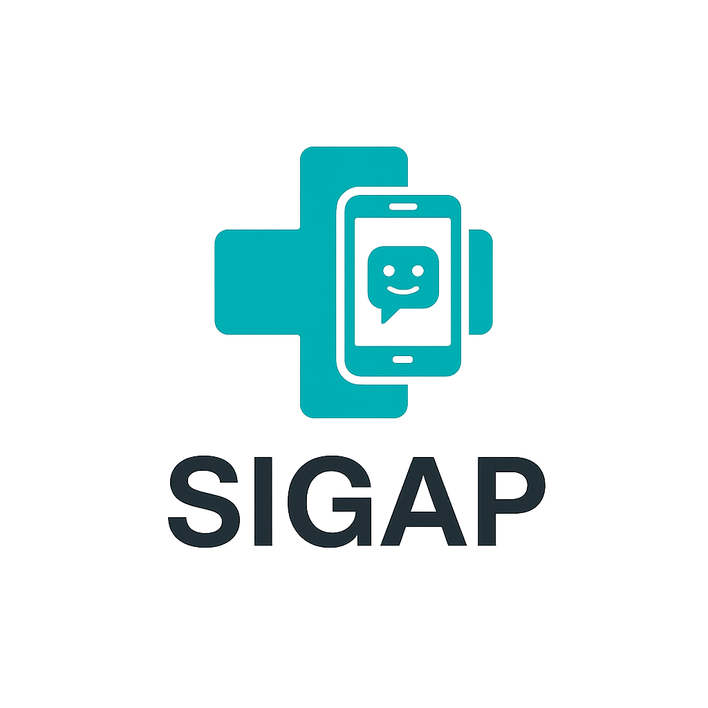
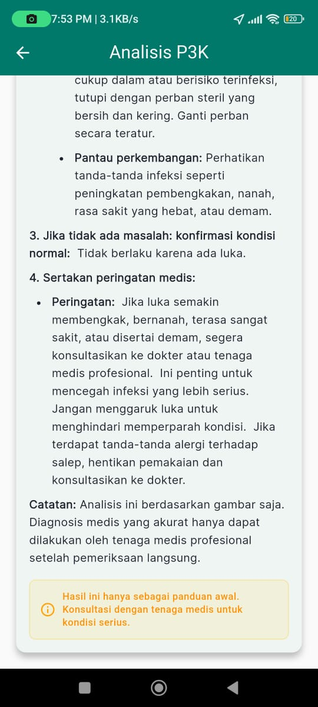
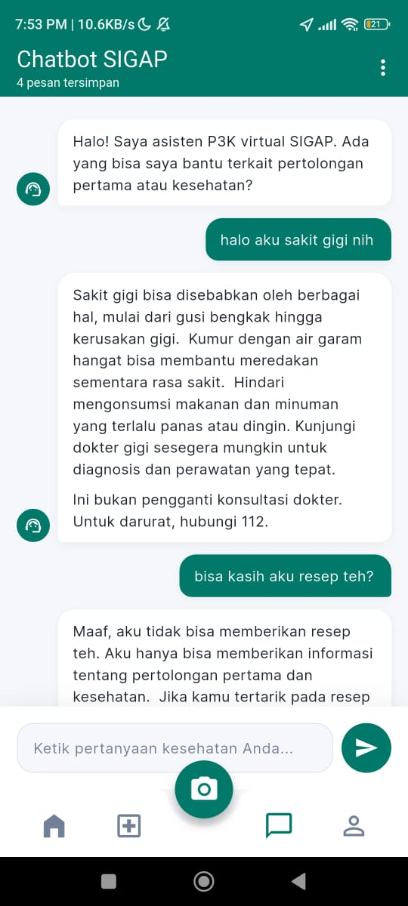
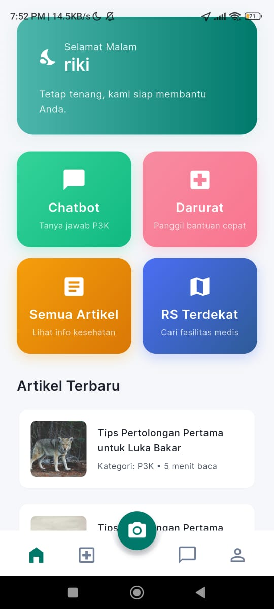

# SIGAP: Platform Respons Cepat Berbasis AI



**SIGAP** adalah sebuah aplikasi mobile inovatif yang dirancang untuk menjadi asisten pertolongan pertama digital Anda. Dibangun untuk memberikan respons cepat dalam situasi darurat medis, SIGAP memanfaatkan kekuatan kecerdasan buatan (AI) untuk memitigasi krisis kesehatan dan memberdayakan masyarakat umum dengan pengetahuan medis yang vital.

## ✨ Fitur Utama

SIGAP hadir dengan tiga pilar fungsionalitas utama yang dirancang untuk memberikan bantuan cepat dan akurat saat paling dibutuhkan.

| Fitur | Deskripsi | Tampilan (Mockup) |
| :--- | :--- | :--- |
| **Deteksi Luka dengan AI** | Gunakan kamera ponsel Anda untuk memindai luka. AI kami akan menganalisis gambar secara instan untuk mengidentifikasi jenis luka, memberikan perkiraan tingkat keparahan, dan menyajikan langkah-langkah pertolongan pertama yang jelas dan mudah diikuti. |  |
| **Pencarian RS Terdekat** | Dalam keadaan darurat, setiap detik berharga. SIGAP secara otomatis mendeteksi lokasi Anda dan menampilkan daftar rumah sakit atau klinik terdekat, lengkap dengan rute tercepat untuk mencapai lokasi tersebut. |  |
| **Chatbot Pertolongan Pertama** | Punya pertanyaan seputar P3K atau gejala medis ringan? Chatbot cerdas kami siap membantu 24/7. Dapatkan jawaban cepat dan panduan untuk berbagai situasi medis umum langsung dari aplikasi. |  |

Fitur pendukung lainnya meliputi:
* **Artikel Kesehatan:** Pustaka konten edukatif untuk meningkatkan literasi kesehatan Anda.
* **Riwayat Medis:** Simpan hasil analisis luka dan catat riwayat medis pribadi Anda dengan aman.

## 🚀 Teknologi yang Digunakan

Aplikasi ini dibangun dengan tumpukan teknologi modern untuk memastikan performa yang andal, responsif, dan skalabel.

* **Framework:** Flutter
* **Backend & Database:** Firebase (Authentication, Firestore)
* **AI & Machine Learning:** Google Gemini
* **Layanan Peta & Rute:** openrouteservice
* **Arsitektur:** MVVM (Model-View-ViewModel)

## 🛠️ Memulai (Getting Started)

Untuk menjalankan proyek ini di lingkungan pengembangan lokal Anda, ikuti langkah-langkah berikut.

### Prasyarat

* Pastikan Anda sudah menginstal [Flutter SDK](https://flutter.dev/docs/get-started/install).
* Sebuah *code editor* seperti VS Code atau Android Studio.
* Emulator Android atau iOS, atau perangkat fisik.

### Instalasi

1.  **Clone repositori ini:**
    ```sh
    git clone [URL-repositori-Anda]
    ```
2.  **Masuk ke direktori proyek:**
    ```sh
    cd sigap
    ```
3.  **Install semua *dependencies*:**
    ```sh
    flutter pub get
    ```
4.  **Jalankan aplikasi:**
    ```sh
    flutter run
    ```

## 👥 Tim Kami

Aplikasi ini dikembangkan oleh tim mahasiswa dari **Universitas Amikom Yogyakarta**:

* **Difa Dlyaul Haq**
* **Praditus Egi Danuarta** 
* **Muhammad Adib Najwan** 

---
